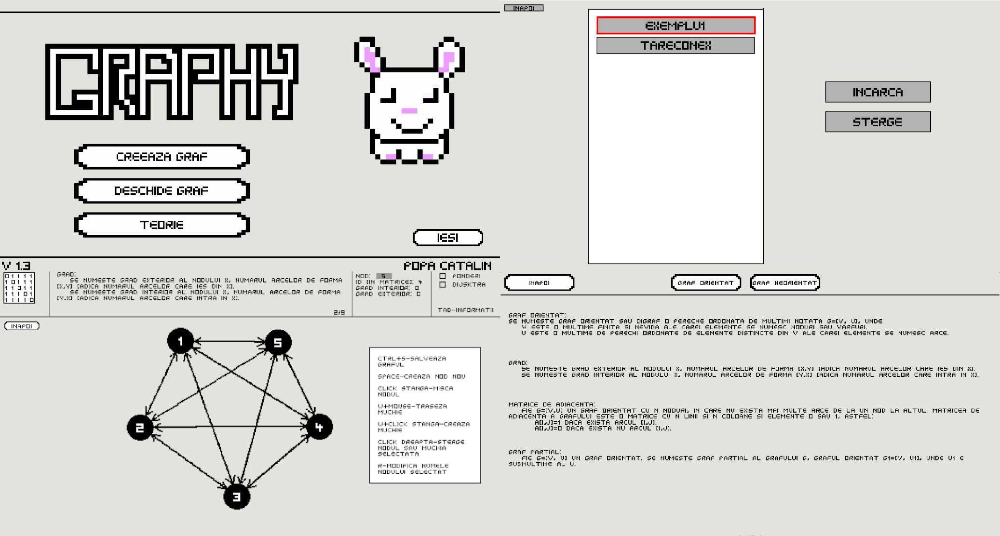

# Graphy

Graph editor made in C++ and Win32 API.

## Overview

Graphy is an easy-to-use app developed to help students visually learn about one of the most important data structure in programming, graphs.

## Features

This project is still a work in progress. Items without a check mark are planned but not yet implemented at this time.

- [x] Save/load system 
- [x] Theory Tab
- [x] Visualization of the distance between nodes
- [x] Dijkstra’s Shortest Path Algorithm
- [ ] Prim's algorithm
- [ ] Kruskal's algorithm
- [ ] Support for the english language

Graphy comes with it's own engine written in C++ and with it's own sprite editor developed using C++ and OpenGL.

## System requirements

For now, Graphy was developed and tested only on Windows 10, so, to be sure you can run this app, you need Windows 10.

## Documentation

Application's [documentation](Graphy-doc/Documentatie.pdf) is written in romanian.

## Building

Run GenerateProject.bat.

## Project structure
Path | Description
-----|------------
`\Engine` | Contains all the code written to make the app development easier, it provides: event system, renderer, logger, GUI, maths library
`\Graphy` | Application source code
`\Graphy\Resources` | Assets used by the app
`\Graphy-doc` | Documentation
`\Sprite Editor` | The app used to create the visual assets

## Credits

### For graphs theory
* [pbInfo Oriented Graphs](https://www.pbinfo.ro/articole/509/grafuri-orientate)
* [pbInfo Undirected Graphs](https://www.pbinfo.ro/articole/810/grafuri-neorientate)

### For algorithms
* [Bresenham Algorithm](http://members.chello.at/~easyfilter/bresenham.html)
