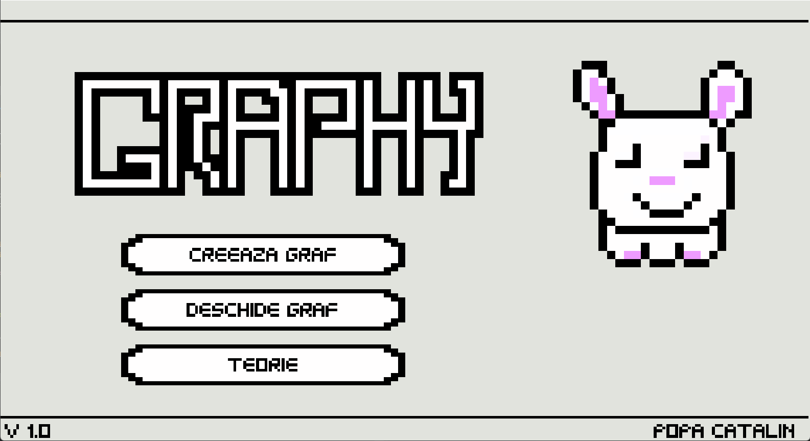

# Graphy
Graphy is a tree editor made in C++ and Win32 API.

# Controls
 - Right-click: delete node
 - Left-click: add node
 - W: tie nodes
 - R: edit mode
 - Tab (in main menu): load tree menu

# Language
Romanian

# Screenshots

